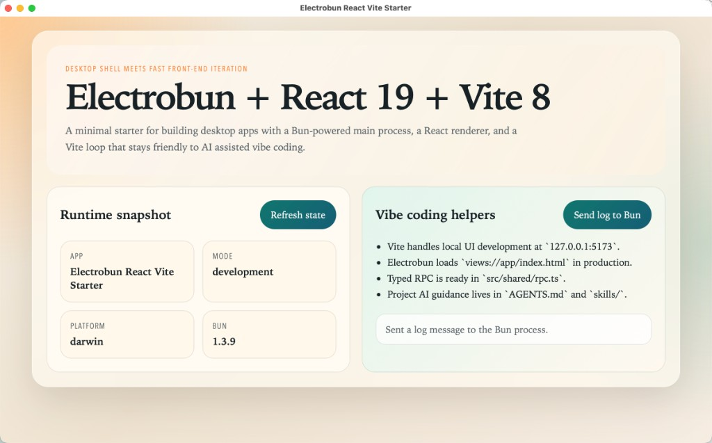

# electrobun-vite

把第一次上手需要的命令收敛成最短主路径：单配置、Quick Start、react-ts 模板，基于 **Electrobun 1.16** + **React 19** + **Vite 8**。

**English:** [README.md](README.md)



**官网**：[https://nova-infra.github.io/electrobun-vite/](https://nova-infra.github.io/electrobun-vite/)

---

## Quick Start

1. **创建项目**

   **一键创建（无需克隆仓库）：**
   ```bash
   npx -p @nova-infra/electrobun-vite create-electrobun my-app
   cd my-app
   ```
   使用 Bun 时：`bunx -p @nova-infra/electrobun-vite create-electrobun my-app`

   **从本仓库执行**（monorepo 根目录）：
   ```bash
   bun install
   bun run new -- my-app
   cd my-app
   ```

2. **本地开发**
   ```bash
   bun install
   bun run dev
   ```
   Vite renderer 与 Electrobun 桌面壳会一起启动。

3. **构建与预览**
   ```bash
   bun run build
   bun run preview
   ```
   `preview` 默认会先 build；已有产物时可加 `--skipBuild`。

---

## 本仓库命令（Workspace）

| 命令 | 说明 |
|------|------|
| `bun run dev` / `bun run dev:demo` | 以 demo 为根启动开发 |
| `bun run dev:template` | 以模板项目启动开发 |
| `bun run dev:docs` | 启动文档站点 |
| `bun run new -- <name>` | 脚手架生成新项目（调用 create-electrobun） |
| `bun run build` | 构建 demo + 模板 |
| `bun run build:docs` | 构建文档站 |
| `bun run typecheck` | 类型检查 |

---

## CLI 概览

- **`electrobun-vite [root]`**（或 `dev` / `serve`）— 启动开发：Vite + Electrobun；`--rendererOnly` 仅启动 renderer。
- **`electrobun-vite build [root]`** — 构建 renderer 并交给 Electrobun 打包。
- **`electrobun-vite preview [root]`** — 用生产资源启动桌面应用；`--skipBuild` 跳过构建。
- **`electrobun-vite info [root]`** — 输出解析后的配置与版本信息。
- **`create-electrobun <projectName>`** — 创建新项目（当前模板：react-ts）。

常用全局参数：`-c, --config`、`-l, --logLevel`、`--clearScreen`、`-m, --mode`、`-w, --watch`、`--outDir`。

---

## 仓库结构

| 路径 | 说明 |
|------|------|
| [packages/electrobun-vite](packages/electrobun-vite) | 集成 CLI、配置加载、脚手架、图标与日志 |
| [apps/demo](apps/demo) | 验收应用，多 tab 演示 Electrobun 能力 |
| [templates/react-ts](templates/react-ts) | 默认 starter 模板 |
| [apps/docs](apps/docs) | 官网源码，部署到 GitHub Pages |

项目层围绕 **一个** `electrobun.vite.config.ts`：renderer 与 Electrobun 配置同文件。

---

## 应用图标（macOS）

运行 `dev` 或 `build` 时，electrobun-vite 会在应用根目录生成符合 Electrobun 约定的 **`icon.iconset`**（来源：项目内 `AppIcon.appiconset/icon-1024.png` 或包内默认图标）。生成配置时会注入 `build.mac.icons: "icon.iconset"`。

---

## 文档发布

文档由 [apps/docs](apps/docs) 构建，通过 [.github/workflows/deploy-docs.yml](.github/workflows/deploy-docs.yml) 部署到 GitHub Pages。仓库设置中需启用 **GitHub Pages → Source: GitHub Actions**。生产路径由 `DOCS_BASE_PATH` 控制（当前为 `/electrobun-vite/`）。
